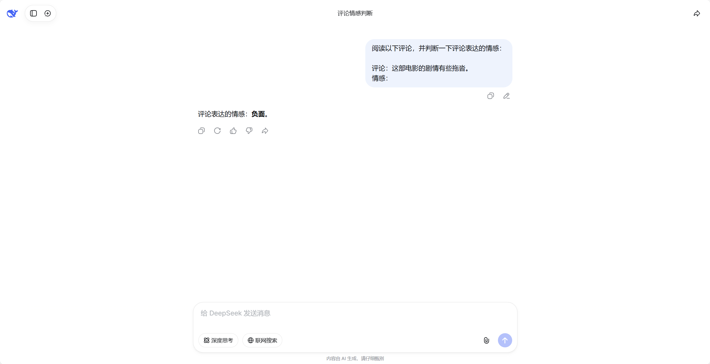

# 第四节 上下文学习与提示词技术

在学习 GPT 结构的过程中，我们提到过**上下文学习**以及它所包含的各种提示模式（Zero-shot、One-shot、Few-shot）。可以了解到，这是一种只需提供不同数量的参考示例，在推理阶段不发生任何梯度反向传播或权重更新，仅凭借提示词就能让大模型完成特定任务的全新交互范式。既然没有实际的学习更新过程，模型是如何做到这一点的？本节我们就深入探究它的工作机制，以及当遇到难度瓶颈时，如何利用提示词技术进一步激发模型的推理潜能。

## 一、零样本与少样本机制

### 1.1 零样本学习 (Zero-Shot Learning)

**零样本学习**是指在提示词中仅提供任务指令和待处理的输入内容，而不提供任何预期输出的参考示例。大语言模型凭借预训练阶段积累的广博知识，直接对未见过的任务进行处理。以常见的情感分析任务为例，下面是在没有任何示例的情况下让模型判断文本情感倾向的典型设定：

```text
阅读以下评论，并判断一下评论表达的情感：

评论：这部电影的剧情有些拖沓。
情感：
```

如图 6-34 所示，我们在 DeepSeek 的网页端测试一下这个输入，可以看到模型的输出为“评论表达的情感：负面。”。

<div align="center">
  
  <p>图 6-34 零样本学习示例</p>
</div>

在这个场景下，模型不只是机械地弹出一个分类标签，而是输出了一句完整的自然语言“评论表达的情感：负面。”，但它准确地落在了`负面`这个情感情绪词汇上。之所以能够做到这一点，并不是因为模型在预训练时见过完全一样的“判断该电影评论”的任务，而是得益于模型在海量语料上预训练所建立的**共享语义空间**。在预训练阶段，模型学习到了“电影”、“剧情”、“拖沓”等词汇的表征，以及这些词汇与“负面”情感概念在潜空间中的深层关联。当我们下达自然语言指令时，零样本学习本质上是利用模型强大的指令遵循能力，通过理解提示词的字面含义，将当前的新任务映射到其已学会的底层语义概念上。这种语义映射会直接影响模型预测下一个 token 时的**概率分布**，使得与“负面”相关的词汇在当前上下文词汇表中的生成概率被显著放大并被依次采样输出，从而在不更新任何权重的情况下顺畅地完成了任务。


